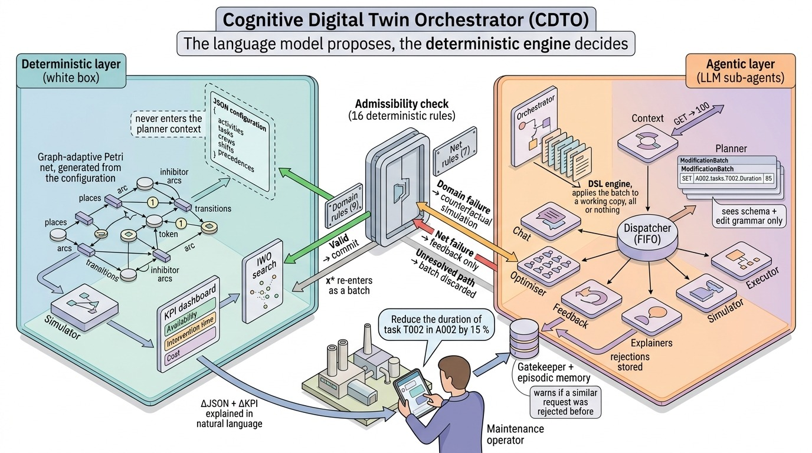

# CDTO: Cognitive Digital Twin Orchestrator

Code, results and reproduction scripts of the paper *An Agentic Artificial Intelligence Framework
for Operator-Driven Interaction with Petri Net Maintenance Models in Industry 5.0*.



The CDTO is an agentic AI framework that lets an operator read, modify, simulate, explain and
optimise a Petri net maintenance model in natural language. A LangGraph dispatcher routes each
request to eight sub-agents. The planner turns a request into a typed edit batch in a small DSL
(`SET`, `DELETE`, `APPEND`, `REMOVE_ITEM`, `GET`); a deterministic executor applies it to a
working copy; and a deterministic validator of 16 rules decides whether the result is admissible
before it is committed. Admitted configurations are simulated as a stochastic Petri net and the
change in KPIs is explained. An optimisation layer (Invasive Weed Optimisation) searches for a
configuration that meets a KPI target, and its result passes the same check as any edit.

> **This release does not include third-party code.** The Petri net engine and the optimizer are
> left out; see [What this release cannot reproduce](#what-this-release-cannot-reproduce) and
> [THIRD_PARTY.md](THIRD_PARTY.md).

## Contents

| Folder | What it holds |
|---|---|
| `input_agent/` | The agent graph, its sub-agents and prompts, the DSL (`PetriConfigEngine`) and the validator (`input_agent/src/tools.py`) |
| `core/` | FastAPI backend of the web demo (`api.py`) and the server of the frontend |
| `frontend/` | Web interface of the demo |
| `config/` | Paths of the input/output folder of the simulations |
| `benchmarks/` | Benchmark runners, metrics, uncertainty quantification, figures, humanisation check and case study |
| `benchmarks/results/` | Results behind the paper: tables, figures, manifests and the case-study runs |
| `docs/` | Documentation of the validator, the benchmark, the humanisation check, the case study and the reproduction of every table and figure |
| `tests/` | Unit tests |
| `test_inputs/` | Example configurations |

Large and raw files are in the Zenodo deposit, not in git: the two datasets, the raw and
re-scored per-call outputs of the benchmark, the per-batch results of the validator pass, the
per-call log of the humanisation check, the logs of the case-study runs and every result PNG.
`benchmarks/results/zenodo_files.sha256` lists them with their checksums.
**Zenodo: [DOI to be added when the deposit is published].**

## Installation

Python 3.13 (the results were produced with 3.13.14 on Windows 11).

```powershell
python -m venv .venv
.venv\Scripts\activate
python -m pip install --no-deps -r requirements.lock
copy .env.example .env      # only for the steps that call a model
```

`requirements.lock` pins every package of the environment the results were produced with, and
`--no-deps` installs exactly those versions. That environment has one declared conflict, which
pip's resolver would refuse and `pip check` reports: `langchain-huggingface` 1.2.0 declares
`huggingface-hub<1.0`, and the environment has `huggingface-hub` 1.4.1, which `transformers`
5.1.0 requires. The tests and every result of this repository were produced with it.
`pyproject.toml` lists the direct dependencies with the same versions.

**Windows:** define `PYTHONIOENCODING=utf-8` before running the scripts
(`$env:PYTHONIOENCODING = "utf-8"` in PowerShell). Several scripts print non-ASCII characters and
fail with the default console encoding when their output is redirected to a file.

To use the files of the Zenodo deposit, extract it at the repository root, so that each file lands
at the path listed in `benchmarks/results/zenodo_files.sha256`, and check them with
`sha256sum -c benchmarks/results/zenodo_files.sha256`.

## Requirements

| Steps | Hardware | Models and services |
|---|---|---|
| Offline steps (rescoring, intervals, tables, figures, validator pass, comparison of the humanisation check) | CPU only | None |
| Benchmark runs | CPU for the metered backends; a GPU for the local ones | Anthropic API (`claude-sonnet-4-6`), OpenAI API (`gpt-5.4`), Ollama (`gpt-oss:20b`, `llama3.1:latest`); the April 2026 runs did not record the Ollama version or the model digests |
| Humanisation check and case study | The September 2026 runs used an NVIDIA RTX 5080 (16 GB) | Ollama 0.24.0; `gpt-oss-20b-ctx32k` (digest `65086a4a68ab43873b6e9d95ea7efc31cc1517c4a5a27f0c001f4abf129b731f`, from [the Modelfile](benchmarks/humanisation_check/Modelfile.gpt-oss-20b-ctx32k) on `gpt-oss:20b`, digest `17052f91a42e97930aa6e28a6c6c06a983e6a58dbb00434885a0cf5313e376f7`); `qwen2.5:32b` (digest `9f13ba1299afea09d9a956fc6a85becc99115a6d596fae201a5487a03bdc4368`) |
| Case study, category F | The IWO runs on the CPU; it took 67 minutes in the recorded run | As above |

The agent downloads the sentence-transformers model `all-MiniLM-L6-v2` from Hugging Face on first
use (episodic memory and documentation lookups). Model settings go in `.env` or in the
environment; see [.env.example](.env.example). [docs/benchmark.md](docs/benchmark.md#deployment-environments)
gives the serving conditions of every run.

## Reproducing the paper

Each row gives the command, the file it writes and what it needs: **git** (this repository),
**Zenodo** (the deposit), **LLM** (model calls), **engine** or **optimizer** (third-party code).
Commands run from the repository root. [docs/reproduce.md](docs/reproduce.md) gives every command
with its arguments, and maps each figure and table of the paper to its file.

| Paper | Command | Result | Needs |
|---|---|---|---|
| `tab:cdto_improvement_summary` | `python benchmarks/metrics/cdto_vs_vanilla_summary.py` | `benchmarks/results/cdto_vs_vanilla_by_model_axis_regime.csv` | git |
| `fig:cost_axis`, `fig:fidelity_axis` | `python benchmarks/aggregator/plot_multi_model_uq.py --axis <complexity/completeness> ...` | `benchmarks/results/models/aggregated/multi_model_uq_<axis>_v2.pdf` | git |
| Per-level means and intervals (note of `tab:cdto_improvement_summary`) | `python benchmarks/metrics/per_level_tables.py` | `benchmarks/results/per_level/` | git |
| `\tokflat`, `\tokgrowth`, `\tokcross` | `python benchmarks/metrics/token_cost_summary.py` | `benchmarks/results/token_cost_summary.csv` | git |
| Footnote of Section 5 (zero-token calls) | `python benchmarks/metrics/zero_token_calls.py` | `benchmarks/results/zero_token_calls_by_axis.csv` | Zenodo |
| Output-budget thresholds C* (`supp:tab:cstar`) | `python benchmarks/metrics/c_star_by_backend.py` | `benchmarks/results/c_star_by_backend.csv` | Zenodo |
| Truncation at the output budget (Sections 5 and 6) | `python benchmarks/metrics/output_truncation.py --axis <axis>`; the complexity table adds `--models claude-sonnet-4-6 gpt-5.4 gpt-oss_20b llama3.1_latest` | `benchmarks/results/truncation_<axis>_by_level.csv` | Zenodo |
| Corrected excision metric | `python benchmarks/metrics/rescore_results.py` | `benchmark_compare_<axis>_rescored.json` | Zenodo |
| Per-cell 95 % intervals | `python benchmarks/metrics/petri_net_uq.py ...` | `benchmarks/results/models/<model>/<axis>/uq_<axis>_results.csv` | Zenodo |
| `\rejrate`, `\rejreq`, `\rejcatch` (abstract, Section 7, conclusions) | `python benchmarks/metrics/validator_pass.py --rules-commit c818998` | `benchmarks/results/validator_pass/<run>/pe_summary.csv` | Zenodo |
| `\rejcycle`, per-rule table of [docs/validator.md](docs/validator.md) | `python benchmarks/metrics/validator_rule_table.py` | `pe_rules_by_category.csv`, `pe_cycle_only_rejections.csv` | Zenodo |
| Humanisation check (Subsection 4.1) | `python -m benchmarks.humanisation_check.compare --run-dir <run>` | `comparison_planner_executor.csv` | Zenodo (offline part); LLM (full check) |
| `tab:simulation_configuration` | `core/api.py` (`initial_input`) | `S0.json` of each case-study run | git |
| `fig:agent_interactions`, `tab:agent_eval` | `python benchmarks/case_study/rerun_case_study.py ...` | `benchmarks/results/case_study_rerun/<run>/` | LLM, engine; optimizer for category F |
| `fig:gantt_chart_modified` | `python benchmarks/case_study/plot_gantt_comparison.py` | `gantt_A001.pdf` | git (from the recorded simulations); engine to simulate again (`regenerate_gantt.py`) |
| Attribution of each edit (Subsection 4.2) | `python benchmarks/case_study/single_edit_attribution.py` | `benchmarks/results/case_study_attribution/<run>/summary.csv` | engine |
| `supp:fig:iwo_convergence` | `rerun_case_study.py --with-optimization` | `q8/iwo_convergence.png` | Zenodo (recorded); LLM, engine and optimizer to run again |
| `supp:tab:split` | No script: medians of `token_usage` in the raw complexity JSONs | — | Zenodo |
| Datasets | `input_agent/src/dataset_generator_*.py` | `benchmarks/datasets/*.jsonl` | LLM; not bit-reproducible, the files are the datasets |
| Benchmark runs | `benchmarks/comparisons/benchmark_compare_<axis>.py` | `benchmarks/results/models/<model>/<axis>/benchmark_compare_<axis>.json` | LLM |

## What this release cannot reproduce

The Petri net engine and the optimizer are third-party code without a licence that permits
redistribution, so this release leaves them out ([THIRD_PARTY.md](THIRD_PARTY.md)). Everything
that simulates the net or runs the optimizer cannot run here:

- the re-run of the case study (every category: the first answer already simulates the initial
  configuration);
- the simulations behind the execution plans (`regenerate_gantt.py`) and the attribution of each
  edit (`single_edit_attribution.py`);
- the IWO of category F and its convergence plot;
- the simulation and optimisation endpoints of the web demo.

The recorded outputs of those runs are included, and `plot_gantt_comparison.py` redraws the
figure of the execution plans from the recorded simulations. The benchmark, the rescoring, the
intervals, the tables and figures, the validator, the DSL and the humanisation check do not use
third-party code and work as in the full release. The tests of the engine and the optimizer are
skipped automatically.

## Provenance

- The manifests and logs are kept as they were written. They hold the paths of the machine that
  produced them and, for the humanisation check, the alias of the inference server, as a record of
  provenance.
- Commit hashes in the documentation and in the manifests are those of the development
  repository. `RELEASE.json` records the development commit this release was exported from and the
  commits of the agent fixes the case study depends on.
- Runs at temperature 0 without a seed are not bit-reproducible; the offline steps are. The
  intervals are bit-identical with the library versions recorded in the manifests.

## Tests

```powershell
python -m pytest tests
```

The tests marked `engine` or `optimizer` are skipped in this release.

## Licence and third-party code

The code written by Noah Masegosa Cáceres is released under the MIT licence ([LICENSE](LICENSE)).
The licence covers only that code. [THIRD_PARTY.md](THIRD_PARTY.md)
lists the third-party components this release leaves out.
## Citation

See [CITATION.cff](CITATION.cff).
