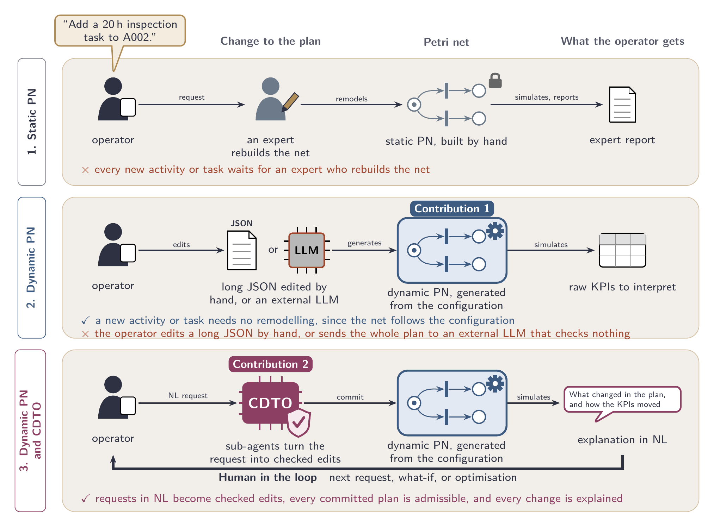
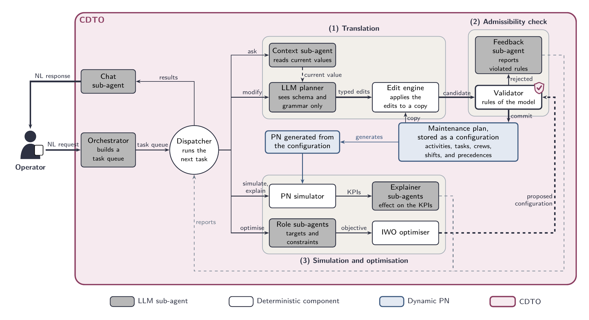

# CDTO: Cognitive Digital Twin Orchestrator

Code, results and reproduction scripts of the manuscript *Agentic Cognitive Digital Twin
Orchestrator for Natural-Language Modification, Simulation and Optimisation of Petri Net
Maintenance Plans*.

## Contributions



*Figure 2 of the manuscript. From a static Petri net (PN) to an agentic interface, shown on one
illustrative request ("Add a 20 h inspection task to A002"). (1) With a static PN, a new activity or
task means rebuilding the net by hand, and the operator depends on an expert for every change. (2) A
dynamic PN, the first contribution, is generated from the configuration, but the operator must edit
a long configuration by hand or send the whole plan to an external LLM that checks nothing. (3) The
CDTO, the second contribution, turns requests in natural language into checked edits, regenerates
and simulates the net, and explains each change, while the operator stays in the loop.*

The manuscript makes four contributions.

1. **A dynamic PN maintenance model**, generated automatically from a configuration written in
   maintenance terms. Every change that the check admits yields a new net without manual modelling,
   which lets the operator test alternatives and run what-if analyses in natural language.
2. **The CDTO**, an agentic architecture in which every plan that reaches the operator has passed a
   deterministic admissibility check, whatever LLM is used. The manuscript states which rules the
   check decides and which errors it cannot detect.
3. **An LLM cost that does not depend on plan size.** The LLM planner receives the configuration
   schema and the edit language, not the configuration itself. The cost of a request therefore
   follows the number of edits it implies, and the plan does not have to leave the facility.
4. **A request-translation benchmark** that varies the number of tasks in the plan and the number of
   instructions per request. It compares the LLM planner and edit engine of the CDTO with a
   single-pass baseline that receives the whole configuration and returns it modified. The
   references are generated with the same engine that applies the edits, so every deviation reflects
   the translation and not the evaluation harness.

## How the CDTO works



*Figure 4 of the manuscript. Components of the CDTO. Grey boxes are LLM sub-agents and white boxes
deterministic components. Indigo boxes form the dynamic PN, and the plum region encloses the CDTO.
Thick arrows mark the loop with the operator and the only path to the plan, which crosses the
validator.*

The CDTO is a human-in-the-loop agentic AI framework that lets an operator inspect, modify,
simulate and optimise a Petri net maintenance plan in natural language. A LangGraph dispatcher
routes each request to eight sub-agents. The LLM planner turns a request into typed edits in a
small edit language (`SET`, `DELETE`, `APPEND`, `REMOVE_ITEM`, `GET`); a deterministic edit engine
applies them to a working copy; and a deterministic validator checks the result against the rules
of the model (Table 2 of the manuscript) before it is committed. Committed plans are simulated as
a timed Petri net, and explainer sub-agents report the change in KPIs. An optimisation layer
(Invasive Weed Optimisation) searches for a configuration that meets a KPI target, and its result
passes the same check as any edit.

> **This release does not include third-party code.** The Petri net engine and the optimizer are
> left out; see [What this release cannot reproduce](#what-this-release-cannot-reproduce) and
> [THIRD_PARTY.md](THIRD_PARTY.md).

## Contents

| Folder | What it holds |
|---|---|
| `input_agent/` | The agent graph, its sub-agents and prompts, the edit engine (`PetriConfigEngine`) and the validator (`input_agent/src/tools.py`) |
| `core/` | FastAPI backend of the web demo (`api.py`) and the server of the frontend |
| `frontend/` | Web interface of the demo |
| `config/` | Paths of the input/output folder of the simulations |
| `benchmarks/` | Benchmark runners, metrics, uncertainty quantification, figures, humanisation check and illustrative case |
| `benchmarks/results/` | Results behind the manuscript: tables, figures, manifests and the runs of the illustrative case |
| `docs/` | Documentation of the validator, the benchmark, the humanisation check, the illustrative case and the reproduction of every table and figure |
| `tests/` | Unit tests |
| `test_inputs/` | Example configurations |

Large and raw files are in the Zenodo deposit, not in git: the two datasets, the raw and
re-scored per-call outputs of the benchmark, the per-batch results of the validator pass, the
per-call log of the humanisation check, the logs of the runs of the illustrative case and every
result PNG. `benchmarks/results/zenodo_files.sha256` lists them with their checksums.
**Zenodo: [DOI to be added when the deposit is published].**

## Installation

Python 3.13 (the results were produced with 3.13.14 on Windows 11).

```powershell
python -m venv .venv
.venv\Scripts\activate
python -m pip install --no-deps -r requirements.lock
copy .env.example .env      # only for the steps that call a model
```

`requirements.lock` pins every package of the environment the results were produced with, and
`--no-deps` installs exactly those versions. That environment has one declared conflict, which
pip's resolver would refuse and `pip check` reports: `langchain-huggingface` 1.2.0 declares
`huggingface-hub<1.0`, and the environment has `huggingface-hub` 1.4.1, which `transformers`
5.1.0 requires. The tests and every result of this repository were produced with it.
`pyproject.toml` lists the direct dependencies with the same versions.

**Windows:** define `PYTHONIOENCODING=utf-8` before running the scripts
(`$env:PYTHONIOENCODING = "utf-8"` in PowerShell). Several scripts print non-ASCII characters and
fail with the default console encoding when their output is redirected to a file.

To use the files of the Zenodo deposit, extract it at the repository root, so that each file lands
at the path listed in `benchmarks/results/zenodo_files.sha256`, and check them with
`sha256sum -c benchmarks/results/zenodo_files.sha256`.

## Requirements

| Steps | Hardware | Models and services |
|---|---|---|
| Offline steps (rescoring, intervals, tables, figures, validator pass, comparison of the humanisation check) | CPU only | None |
| Benchmark runs | CPU for the commercial cloud models; a GPU for the local ones | Anthropic API (`claude-sonnet-4-6`), OpenAI API (`gpt-5.4`), Ollama (`gpt-oss:20b`, `llama3.1:latest`); the April 2026 runs did not record the Ollama version or the model digests |
| Humanisation check and illustrative case | The September 2026 runs used an NVIDIA RTX 5080 (16 GB) | Ollama 0.24.0; `gpt-oss-20b-ctx32k` (digest `65086a4a68ab43873b6e9d95ea7efc31cc1517c4a5a27f0c001f4abf129b731f`, from [the Modelfile](benchmarks/humanisation_check/Modelfile.gpt-oss-20b-ctx32k) on `gpt-oss:20b`, digest `17052f91a42e97930aa6e28a6c6c06a983e6a58dbb00434885a0cf5313e376f7`); `qwen2.5:32b` (digest `9f13ba1299afea09d9a956fc6a85becc99115a6d596fae201a5487a03bdc4368`) |
| Illustrative case, category F | The IWO runs on the CPU; it took 67 minutes in the recorded run | As above |

The agent downloads the sentence-transformers model `all-MiniLM-L6-v2` from Hugging Face on first
use (episodic memory and documentation lookups). Model settings go in `.env` or in the
environment; see [.env.example](.env.example). [docs/benchmark.md](docs/benchmark.md#deployment-environments)
gives the serving conditions of every run.

## Running the experiments

The steps run in this order, from the repository root. Steps 1, 7 and 8 call a model; the others
are offline. Each offline step reads the output of the steps before it, or the same files from the
Zenodo deposit, so the experiments can start at any step. [docs/reproduce.md](docs/reproduce.md)
gives the remaining options of each command.

| Parameter | Values |
|---|---|
| `<axis>` | `complexity`, `completeness` |
| `<model>` | `claude-sonnet-4-6`, `gpt-5.4`, `gpt-oss_20b`, `llama3.1_latest` (results folder of each model) |
| `<base_url>` | `/v1` URL of an OpenAI-compatible server; for Ollama, `http://localhost:11434/v1` |

### 1. Benchmark runs (LLM)

Once per model. They read the two datasets of the Zenodo deposit.

```bash
python benchmarks/comparisons/benchmark_compare_complexity.py --provider <provider> --llm-model <llm_model> --complexity 1 5 10 12 14 16 18 20 24 28 32 40 50 80 100 150 --samples-per-complexity 50
python benchmarks/comparisons/benchmark_compare_completeness.py --provider <provider> --llm-model <llm_model>
```

| LLM | `<provider>` | `<llm_model>` | `<model>` | Extra arguments |
|---|---|---|---|---|
| Claude Sonnet 4.6 | `anthropic` | `claude-sonnet-4-6` | `claude-sonnet-4-6` | — |
| GPT-5.4 | `openai` | `gpt-5.4` | `gpt-5.4` | — |
| gpt-oss:20b | `openai_compatible` | `gpt-oss:20b` | `gpt-oss_20b` | `--llm-base-url <base_url> --request-profile 2026-04-28-benchmark` |
| Llama 3.1 8B | `openai_compatible` | `llama3.1:latest` | `llama3.1_latest` | `--llm-base-url <base_url>` |

The API keys go in `.env` (`ANTHROPIC_API_KEY`, `OPENAI_API_KEY`). Output:
`benchmarks/results/models/<model>/<axis>/benchmark_compare_<axis>.json`.

### 2. Rescoring with the corrected excision metric

```bash
python benchmarks/metrics/rescore_results.py --validation-csv benchmarks/results/rescoring_validation.csv
```

Output: `benchmark_compare_<axis>_rescored.json`, next to each file of step 1.

### 3. Per-cell 95 % intervals

Once per `<model>` and `<axis>`:

```bash
python benchmarks/metrics/petri_net_uq.py benchmarks/results/models/<model>/<axis>/benchmark_compare_<axis>_rescored.json --axis <axis> --seed 42 --csv benchmarks/results/models/<model>/<axis>/uq_<axis>_results.csv --manifest benchmarks/results/models/<model>/<axis>/benchmark_compare_<axis>_manifest.json --plot benchmarks/results/models/<model>/<axis>/petri_uq_plot.png
```

The intervals are bit-identical with the library versions recorded in the manifest.

### 4. Tables and numbers of the text

```bash
python benchmarks/metrics/cdto_vs_vanilla_summary.py
python benchmarks/metrics/per_level_tables.py
python benchmarks/metrics/token_cost_summary.py
python benchmarks/metrics/zero_token_calls.py
python benchmarks/metrics/budget_complexity.py
python benchmarks/metrics/c_star_by_backend.py
python benchmarks/metrics/output_truncation.py --axis completeness
python benchmarks/metrics/output_truncation.py --axis complexity --models claude-sonnet-4-6 gpt-5.4 gpt-oss_20b llama3.1_latest
```

The first three read the intervals of step 3; the others read the files of steps 1 and 2 and the
datasets.

### 5. Figures of the two axes

```bash
python benchmarks/aggregator/plot_multi_model_uq.py --axis complexity --models claude-sonnet-4-6 gpt-oss_20b gpt-5.4 llama3.1_latest --labels "Claude Sonnet 4.6" "gpt-oss-20b" "GPT 5.4" "Llama 3.1"
python benchmarks/aggregator/plot_multi_model_uq.py --axis completeness --models claude-sonnet-4-6 gpt-oss_20b gpt-5.4 llama3.1_latest --labels "Claude Sonnet 4.6" "gpt-oss-20b" "GPT 5.4" "Llama 3.1"
python benchmarks/aggregator/plot_multi_model_uq.py --axis complexity --models claude-sonnet-4-6 gpt-oss_20b gpt-5.4 llama3.1_latest --labels "Claude Sonnet 4.6" "gpt-oss-20b" "GPT 5.4" "Llama 3.1" --panels tokens latency em --layout 1x3 --output benchmarks/results/models/aggregated/multi_model_uq_complexity_rq2.pdf
python benchmarks/aggregator/plot_multi_model_uq.py --axis completeness --models claude-sonnet-4-6 gpt-oss_20b gpt-5.4 llama3.1_latest --labels "Claude Sonnet 4.6" "gpt-oss-20b" "GPT 5.4" "Llama 3.1" --panels em f1 fn fp --layout 2x2 --output benchmarks/results/models/aggregated/multi_model_uq_completeness_rq3.pdf
```

The order of the models sets the colours of the series. The first two commands write the
six-panel figures, `benchmarks/results/models/aggregated/multi_model_uq_<axis>_v2.pdf`
(Supplementary Material C). The last two write the figures of the body, with the panels of each
research question: `multi_model_uq_complexity_rq2.pdf` (tokens, latency and exact match) and
`multi_model_uq_completeness_rq3.pdf` (exact match, F1, omission and collateral rates).
`--panels` takes the metrics in order (`em`, `f1`, `latency`, `tokens`, `fp` for the collateral
rate, `fn` for the omission rate) and `--layout` the grid as rows x columns.

### 6. Offline pass of the validator

```bash
python benchmarks/metrics/validator_pass.py --rules-commit c818998
python benchmarks/metrics/validator_rule_table.py --run-dir benchmarks/results/validator_pass/<run_id>
```

The first command reads the files of step 2 and writes `benchmarks/results/validator_pass/<run_id>/`;
`--rules-commit` records the commit of the development repository that froze the rules. Without
`--run-dir`, the second command reads the recorded run, `20260928T224634Z_c818998_9ed0ce`.

### 7. Humanisation check (LLM)

On an Ollama server. `<run_dir>` is a new folder under `benchmarks/results/humanisation_check/`;
the recorded run is `veritas_qwen25_32b`.

```bash
ollama create gpt-oss-20b-ctx32k -f benchmarks/humanisation_check/Modelfile.gpt-oss-20b-ctx32k
python -m benchmarks.humanisation_check.select_samples --run-dir <run_dir>
python -m benchmarks.humanisation_check.rehumanise --run-dir <run_dir> --model qwen2.5:32b --base-url <base_url>
python -m benchmarks.humanisation_check.fidelity --run-dir <run_dir>
python -m benchmarks.humanisation_check.run_paired --run-dir <run_dir> --llm-base-url <base_url> --derived-model gpt-oss-20b-ctx32k --ssh-host <host>
python -m benchmarks.humanisation_check.compare --run-dir <run_dir>
```

`ollama create` runs on the server and derives the evaluated model: `gpt-oss:20b` with a
32768-token context.
`--ssh-host` records the GPU, the Ollama version and the server settings in the manifest.
`compare` is offline: on the recorded run, with the files of the Zenodo deposit, it rebuilds the
tables of [docs/humanisation_check.md](docs/humanisation_check.md#results).

### 8. Illustrative case (LLM, engine and optimizer)

Not runnable in this release, which leaves out the engine and the optimizer. The driver reads the
model settings from the environment only; [docs/reproduce.md](docs/reproduce.md#illustrative-case-subsections-51-and-61)
lists the variables to set.

```bash
python benchmarks/case_study/rerun_case_study.py --model gpt-oss-20b-ctx32k --base-url <base_url> --preflight-only
python benchmarks/case_study/rerun_case_study.py --model gpt-oss-20b-ctx32k --base-url <base_url>
python benchmarks/case_study/rerun_case_study.py --model gpt-oss-20b-ctx32k --base-url <base_url> --with-optimization
python benchmarks/case_study/regenerate_gantt.py
python benchmarks/case_study/single_edit_attribution.py
python benchmarks/case_study/plot_gantt_comparison.py
```

The second command runs queries 1–7 (categories A to E); the third adds query 8 (category F, the
IWO), which took 67 minutes in the recorded run. The last command does run in this release: it
redraws the execution plans from the recorded simulations.

## Where each result of the manuscript comes from

**Needs:** **git** (this repository), **Zenodo** (the deposit), **LLM** (model calls), **engine** or
**optimizer** (third-party code, not in this release).

| Result in the manuscript | Script | Output | Needs |
|---|---|---|---|
| Tables of the differences between P-E and the single-pass baseline, one per axis (complexity and completeness) | `cdto_vs_vanilla_summary.py` | `benchmarks/results/cdto_vs_vanilla_by_model_axis_regime.csv` (both tables) | git |
| Figures of the results along the complexity and completeness axes | `plot_multi_model_uq.py` | Body: `benchmarks/results/models/aggregated/multi_model_uq_complexity_rq2.pdf` and `multi_model_uq_completeness_rq3.pdf`; Supplementary Material C: the six-panel `multi_model_uq_<axis>_v2.pdf` | git |
| Per-level means and intervals (notes of the two tables of differences) | `per_level_tables.py` | `benchmarks/results/per_level/` | git |
| Token cost along the complexity axis (flatness of P-E, growth of the baseline, crossing level) | `token_cost_summary.py` | `benchmarks/results/token_cost_summary.csv` | git |
| Zero-token calls (footnote of Subsection 6.3) | `zero_token_calls.py` | `benchmarks/results/zero_token_calls_by_axis.csv` | Zenodo |
| Supplementary table of the output-budget thresholds C* | `c_star_by_backend.py` | `benchmarks/results/c_star_by_backend.csv` | Zenodo |
| Truncation at the output limit (Subsections 6.3 and 6.4) | `output_truncation.py` | `benchmarks/results/truncation_<axis>_by_level.csv` | Zenodo |
| Corrected excision metric | `rescore_results.py` | `benchmark_compare_<axis>_rescored.json` | Zenodo |
| Per-cell 95 % intervals | `petri_net_uq.py` | `benchmarks/results/models/<model>/<axis>/uq_<axis>_results.csv` | Zenodo |
| Rejection rates of the validator (Introduction, Subsection 6.2, conclusions) | `validator_pass.py` | `benchmarks/results/validator_pass/<run_id>/pe_summary.csv` | Zenodo |
| Rejections caused only by a cycle; per-rule table of [docs/validator.md](docs/validator.md) | `validator_rule_table.py` | `pe_rules_by_category.csv`, `pe_cycle_only_rejections.csv` | Zenodo |
| Humanisation check (Subsection 5.3) | `benchmarks/humanisation_check/` | `comparison_planner_executor.csv` | Zenodo (offline part); LLM (full check) |
| Table of the initial plan $S_0$ of the illustrative case | `core/api.py` (`initial_input`) | `S0.json` of each run of the illustrative case | git |
| Figure of the user-agent interactions; table of the categories of the illustrative case | `rerun_case_study.py` | `benchmarks/results/case_study_rerun/<run_id>/` | LLM, engine; optimizer for category F |
| Figure of the execution plans of `A001` | `plot_gantt_comparison.py` | `gantt_A001.pdf` | git (from the recorded simulations); engine to simulate again (`regenerate_gantt.py`) |
| Attribution of each edit (Subsection 6.1 and Supplementary Material D) | `single_edit_attribution.py` | `benchmarks/results/case_study_attribution/<run_id>/summary.csv` | engine |
| Supplementary figure of the convergence of the IWO | `rerun_case_study.py --with-optimization` | `q8/iwo_convergence.png` | Zenodo (recorded); LLM, engine and optimizer to run again |
| Supplementary table of the median prompt and completion tokens | No script: medians of `token_usage` in the raw complexity JSONs | — | Zenodo |
| Datasets | `input_agent/src/dataset_generator_*.py` | `benchmarks/datasets/*.jsonl` | LLM; not bit-reproducible, the files are the datasets |
| Benchmark runs | `benchmark_compare_<axis>.py` | `benchmarks/results/models/<model>/<axis>/benchmark_compare_<axis>.json` | LLM |

[docs/reproduce.md](docs/reproduce.md) maps every figure and table of the manuscript, by its LaTeX
label, to its file.

## What this release cannot reproduce

The Petri net engine and the optimizer are third-party code without a licence that permits
redistribution, so this release leaves them out ([THIRD_PARTY.md](THIRD_PARTY.md)). Everything
that simulates the net or runs the optimizer cannot run here:

- the re-run of the illustrative case (every category: the first answer already simulates the
  initial plan);
- the simulations behind the execution plans (`regenerate_gantt.py`) and the attribution of each
  edit (`single_edit_attribution.py`);
- the IWO of category F and its convergence plot;
- the simulation and optimisation endpoints of the web demo.

The recorded outputs of those runs are included, and `plot_gantt_comparison.py` redraws the
figure of the execution plans from the recorded simulations. The benchmark, the rescoring, the
intervals, the tables and figures, the validator, the edit engine and the humanisation check do
not use third-party code and work as in the full release. The tests of the engine and the
optimizer are skipped automatically.

## Provenance

- The manifests and logs are kept as they were written. They hold the paths of the machine that
  produced them and, for the humanisation check, the alias of the inference server, as a record of
  provenance.
- Commit hashes in the documentation and in the manifests are those of the development
  repository. `RELEASE.json` records the development commit this release was exported from and the
  commits of the agent fixes the illustrative case depends on.
- Runs at temperature 0 without a seed are not bit-reproducible; the offline steps are. The
  intervals are bit-identical with the library versions recorded in the manifests.

## Tests

```powershell
python -m pytest tests
```

The tests marked `engine` or `optimizer` are skipped in this release.

## Licence and third-party code

The code written by Noah Masegosa Cáceres is released under the MIT licence ([LICENSE](LICENSE)).
The licence covers only that code. [THIRD_PARTY.md](THIRD_PARTY.md)
lists the third-party components this release leaves out.